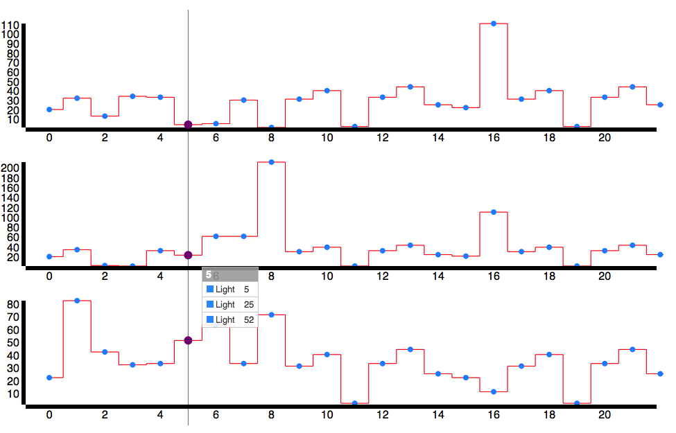

### Example:

### Data model

Before start using the chart, you should organize your data which requested from server to the special Data model, after that you can bind it to the plugin.
	
	var data =
    	{
        	category: 'date',   // or integer
        	x: [1, 3, 5, 7, 9, 11, 13, 15, 29], // x axis. probably timestamps (Date object each item)
        	y: 	// y axis
            	[
                	[2,3,4,3,34,5,6,3,2],
                	[2,3,4,3,34,5,6,3,2],
	                [2,3,4,3,34,5,6,3,2],
    	            [2,3,4,3,34,5,6,3,2]
        	    ],
	        alias: ['Light', 'Power', 'Battery', 'Temperature']  // each chart alias name
    	}

### How to use:

	var myChart = mulChart.generate({
		bindto: '#element',
		data: data,
		size: {
			width: 800,
			height: 200
		},
		color: {
			pattern: ['green', 'yellow', 'gray', 'red']
		},
		stuff: {
			alias: ['Light', 'Power', 'Battery', 'Temperature'],
			unit: []
		}
	});		
	
You can get the value of each configure item:

	myChart.bindto();  // output '#element'
	myChart.data();
	myChart.size();  // output {width:800, height:200}
	myChart.color();
	
Or set value to them:

	myChart.bindto('#do');
	myChart.size({width: 600, height: 100});
	
After the value set, then you can redraw to update the chart:

	myChart.redraw();
		
### Redraw

You have two ways to redraw:

	myChart.redraw({
		bindto: '#do',
		size: {
			width: 1000,
			height: 150
		},
		color: {
			pattern: []
		}
	});		
	
Or like writting d3:

	myChart
		.bindto('#do')
		.size({
			width: 1000,
			height: 150
		})
		.color({
			pattern: []
		})
		.redraw();

### To do list:

*	<del>可让x轴为时间显示</del>
*   <del>添加 AMD 支持</del>
*	每单个表格的名称、单位、颜色标识
*	可自行通过修改 less 来改变 mulChart 的样式
